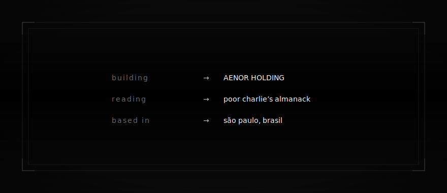

<!-- ════════════════════════════════════════════════════════════════ -->
<!--                  F E L I P E   P R E S E T I                     -->
<!--                builder · operator · founder                      -->
<!--                AENOR HOLDING · SP · MMXXV                        -->
<!-- ════════════════════════════════════════════════════════════════ -->

 

 

<i>"decades reveal what quarters conceal."</i>

 
 

<code>SÃO&nbsp;PAULO&nbsp;🇧🇷</code> &nbsp;·&nbsp; <code>MMXXV</code> &nbsp;·&nbsp; architecting <a href="https://aenor.com.br"><b>AENOR</b></a>

 
 

&nbsp;&nbsp;&nbsp;&nbsp;

 
 
 

 
 
 

<code>◆</code>

 
 

&nbsp;&nbsp;&nbsp;&nbsp;&nbsp;

 

&nbsp;&nbsp;&nbsp;&nbsp;&nbsp;

 
 
 

<code>◆</code>

 
 

 
 
 

 
 

 

<code>-23.5505°&nbsp;S</code> &nbsp;·&nbsp; <code>-46.6333°&nbsp;W</code>

 

são paulo · brasil 🇧🇷 &nbsp;·&nbsp; MMXXV &nbsp;·&nbsp; <a href="https://aenor.com.br">aenor.com.br</a>

 
 

<i>built quietly. built to last.</i>

 
 

